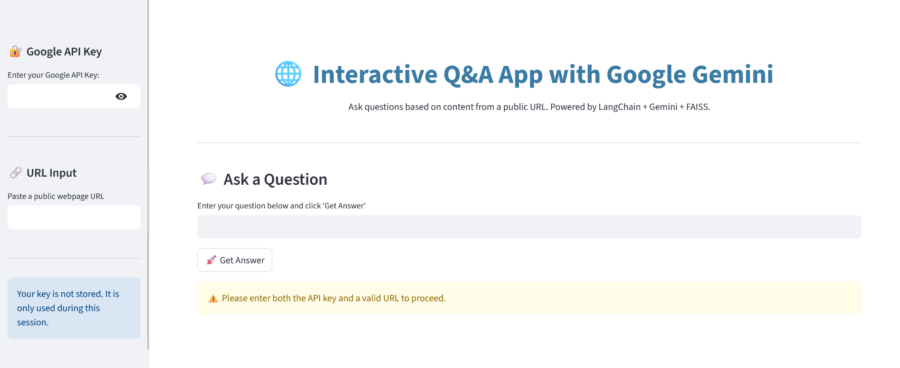

# Gemini-Powered Chatbot for PDF and URL Q&A

This project is a **Gemini API-powered chatbot** built with **LangChain** and **Retrieval-Augmented Generation (RAG)**. It allows users to ask questions based on the contents of uploaded **PDFs** or public **URLs**.

🌐 **Live Demo (Hugging Face Space)**:  
👉 [https://huggingface.co/spaces/Aravindspace/Gemini_Powered_Chatbot_for_URL_PDF](https://huggingface.co/spaces/Aravindspace/Gemini_Powered_Chatbot_for_URL_PDF)

---

## 🚀 Features

- 🔗 Accepts **URLs** and **PDF documents** as input
- 🤖 Powered by **Google Gemini** for high-quality responses
- 📚 Uses **RAG** to retrieve relevant context before answering
- 🧠 Built using **LangChain** and **Streamlit** (depending on UI)
- 🧪 Easily testable via Hugging Face Space (no setup needed)

---

## 🛠️ Tech Stack

- **Language Model**: Google Gemini API
- **Framework**: LangChain
- **Vector Store**: FAISS
- **Interface**: Gradio / Streamlit
- **Deployment**: Hugging Face Spaces

---

## 🧪 How It Works

1. User uploads a PDF or provides a URL and provide google api.
2. The content is chunked and embedded into a vector store.
3. User asks a question.
4. Relevant chunks are retrieved using similarity search.
5. Gemini API generates a response using retrieved context.

---

## 📺 Demo Screenshots

---

## 📎 Links

- 🧠 **Hugging Face Space**: [https://huggingface.co/Aravindspace](https://huggingface.co/Aravindspace)
- 🧾 **Google Gemini API**: [https://ai.google.dev](https://ai.google.dev)
- 🔗 **LangChain**: [https://github.com/langchain-ai/langchain](https://github.com/langchain-ai/langchain)

---

## 🙌 Acknowledgements

- [LangChain](https://github.com/langchain-ai/langchain)
- [Google Gemini](https://ai.google.dev)
- [Hugging Face Spaces](https://huggingface.co/spaces)

---

## 📧 Contact

Feel free to connect via GitHub (https://github.com/aravindspace)